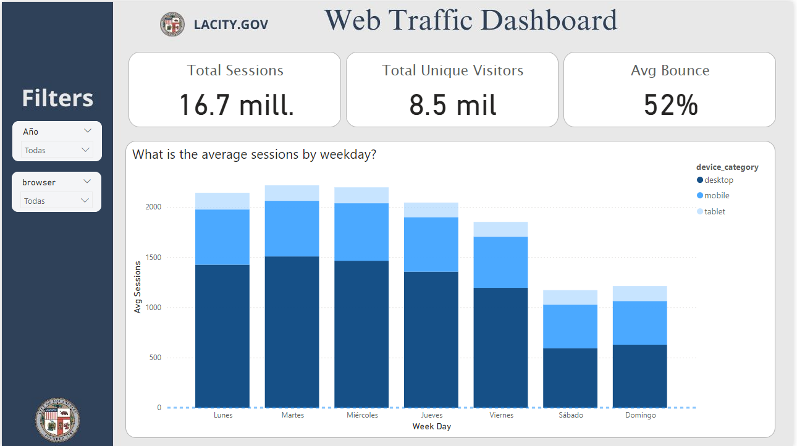

# LACity.gov Web Traffic Analysis (2014-2019)

## Project Background
This project focuses on analyzing web traffic data for **LACity.gov**, the official website of the City of Los Angeles. The dataset contains over **8 million records** spanning **2014 to 2019**. The analysis aims to provide insights into user behavior, highlight trends, and offer data-driven recommendations to enhance user experience and web performance.

The website serves as a critical resource for LA residents, providing essential services and information. By understanding traffic patterns, we can improve user engagement, communication, and performance, especially during critical events like natural disasters.

---

## Important Terminology
- **Sessions**: A visit to the website, including all interactions within that visit.
- **Bounce Rate**: Percentage of sessions where users leave the site without interacting with it.
- **Device Categories**: Desktop, mobile, and tablet devices used to access the website.

---

## Executive Summary
The analysis, conducted on a dataset of **8 million records**, revealed key insights into:
- **Device usage** trends
- **Traffic patterns** over time
- **User engagement** (e.g., bounce rates)

The findings were visualized using a **PowerBI Dashboard** to uncover how users interact with the site. Notable observations include:
- Traffic peaks during weekdays, with significant spikes during events like the **December 2017 wildfires**.
- A steady decline in traffic occurred from **2017 to 2019**, warranting further investigation.

---
## PowerBI Dashboard

---

## Dataset Information
The original dataset is publicly available on Kaggle:
- [LACity.gov Website Traffic Dataset](https://www.kaggle.com/datasets/cityofLA/lacity.org-website-traffic/data)